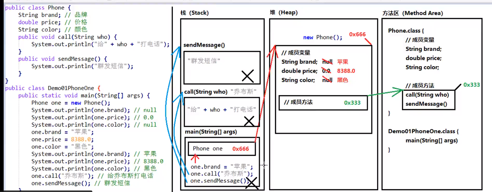
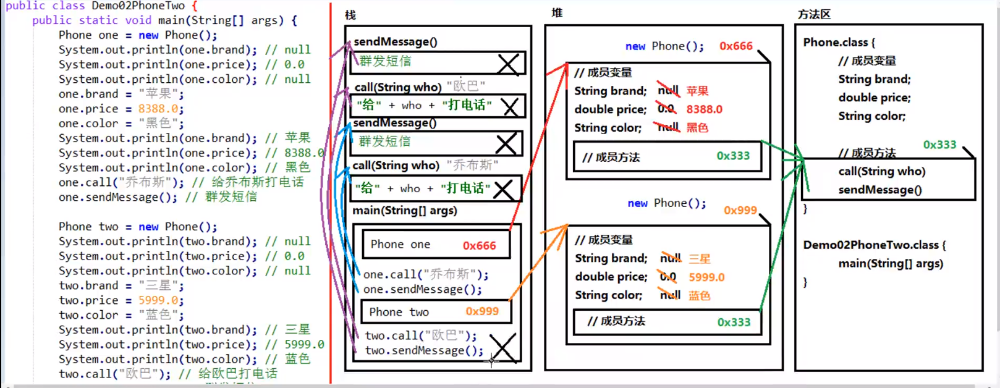
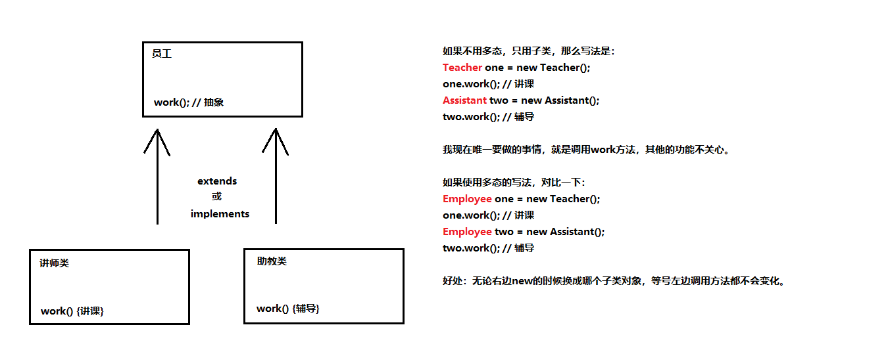

# 基础

## 2020/6/12

### elements

- **javac 编译 .java -> .class**  
- **java 运行**  

```java
public class HelloWorld{
    //程序的起点main
        public static void main(String[] args)
        //打印内容
            System.out.println("Hello World");
        }
    }
```

### 关键字

  1. 完全小写的字母 public  
  2. 有特殊颜色的  
  
### 标识符命名规则

  1. 标识符 英文字母 数字 美元符号 下划线  
  2. 不能数字开头  
  3. 不能是关键字  
  
### 命名规范

  1. 类名规范 首字母大写 后面每个单词首字母大写 大驼峰 HelloWorld  
  2. 变量名规范/方法名   首字母小写，后面每个单词首字母大写 helloWorld  
  
### 常量：程序中固定不变的

   1. 字符串常量:双引号引起来的部分         eg: "1265ada"  
   2. 整型常量:直接数字 整数                11 100 30 -25  
   3. 浮点数常量: 带小数点的数字             2.5 10.00 -3.10 0.0  
   4. 字符常量: 单引号引起来的单个字符，只能有一个        'a' '5' '!'  
   5. 布尔常量:                             true false  
   6. 空常量： null 没有任何数据。  

```java
public static void main(String[] args) {
    //打印字符串常量
    System.out.println("abc");
    System.out.println("");//字符串两个双引号中间的内容为空
    System.out.println("xyz");

    //整数常量
    System.out.println(30);
    System.out.println(-500);

    //浮点数常量
    System.out.println(3.14);
    System.out.println(23.5);

    //字符常量
    System.out.println('A');
    System.out.println('1');

    //布尔常量
    System.out.println(true);
    System.out.println(false);
}
```

### 基本数据类型

- 整数型  `byte` `short` `int` `long`  
- 浮点型  `float` `double`  
- 字符型  `char`  
- 布尔型  `boolean`  
  
### 引用数据类型

- 字符串  
- 数组  
- 类  
- 接口  
- Lambda  
- tips:

 1. 字符串不是基本类型，而是引用类型  
 2. 浮点型可能只是一个近似值，并非精确值  
 3. 数据范围和字节数不一定相关  `float` 数据范围比`long`更加广泛 但 `float`是4字节 `long`  8字节  
 4. 浮点数默认`double`, 使用`float` 后缀F。  
  整数，默认int 使用long 后缀L。  

## 2020/6/13  

### 变量 运行期间可以改变的量

   **数据类型  变量名称；**
   **变量名称 = 数据值**  
   **数据类型 变量名称 = 数据值**  

```java
public class Demo02Variable {
    public static void main(String[] args) {
        //创建一个变量
        //数据类型 变量名称
        int num1;
        num1 = 20;
        System.out.println(num1);
        //改变数字
        num1 = 11;
        System.out.println(num1);
        //使用一部
        //数据类型 变量名称 = 数据值
        int num2 = 5;
        System.out.println(num2);
        System.out.println("==============");

        byte num3 = 30;
        System.out.println(num3);

        short num5 = 50;
        System.out.println(num5);

        long num6 = 3000000000L;
        System.out.println(num6);

        float num7 = 2.5F;
        System.out.println(num7);

        double num8 = 1.2;
        System.out.println(num8);

        char char1 = 'A';
        System.out.println(char1);

        char1 = '中';
        System.out.println(char1);

        boolean bool = true;
        System.out.println(bool);


        boolean bool2 = bool;
        System.out.println(bool2);
    }
}
```  

### 使用多个变量注意事项

1.多个变量名称不能重复。  
2.`float`和`long` 的F和L后缀不能丢。  
3.`byte`、`short` 数据值不能超出范围。  
4.没有赋值的变量不能直接使用。  
5.变量的使用不能超出作用域的范围。  
6.可以通过一个语句创建多个变量。**不推荐**  

### 数据类型转换

当数据类型不一样时，会发生数据类型转换。  

- 自动类型转换(隐式)

1. 特点：代码不需要特殊处理，自动完成。  
2. 规则：数据范围从小到大。  

```java
public class DataType {
    public static void main(String[] args) {
        System.out.println(1024);//整数，默认int类型
        System.out.println(3.14);//浮点数，默认double类型
        // 左边 long类型 , 右边默认的int类型，左右不一样
        //int -->long 符合从小到大 发生了自动转换
        long num1 = 100;
        System.out.println(num1);//100

        //左边double 右边float
        //float -->double 从小到大 发生自动转换
        double num2 = 2.5F;
        System.out.println(num2);

        //long --> float 从小到大。
        float num3= 30L;
        System.out.println(num3);
    }
}
```  

- 强制类型转换(显式)

 1. 特点：代码进行特殊格式处理，不能自动完成。
 2. 范围小的类型 范围小的变量名 = (范围小的类型) 范围大的数据

- **注意事项**

 1. 强制类型转换可能发生精度损失，数据溢出。  
 2. _`byte`/`short`/`char`_ 这三种可以发生数学运算 如“+”。  
 3. _`byte`/`short`/`char`_ 在运算是会首先提升为int然后进行计算。  
 4. **boolean** 类型不能发生数据类型转换

```java
public class DataType2 {
    public static void main(String[] args) {
        //左边int 右边long
        //long --> int 不是从小到大，不能自动转换
        // 范围小的类型 范围小的变量名 = (范围小的类型) 范围大的数据
        int num = (int) 100L;
        System.out.println(num);

        //long强制转换成int类型
        int num2 = (int) 6000000000L;
        System.out.println(num2);//1705032704  溢出

        //double --> int  强制类型转换
        int num3 = (int) 3.5;
        System.out.println(num3);// 3 精度损失

        char c1 = 'A';
        System.out.println((char) (c1 + 1));

        byte num4 = 40;
        byte num5 = 50;
        //byte + byte --> int + int =int;
        //byte result1 = num4 + num5;
        int result1 = num4 + num5;
        System.out.println(result1);//不兼容的类型: 从int转换到byte可能会有损失

        short num6 = 60;
        //byte + short --> int + int = int;
        // int 强制转换为short 要保证不超出范围
        short result2 = (short) (num4 + num6);
        System.out.println(result2);
    }
}
```  

* * *
对于_`byte`/`short`/`char`_三种类型，如果右侧赋值没有超过范围，那么Java编译器会自动隐含的补上_(`byte`)/(`short`)/(`char`)  

```java
public class Notice{
    public static void main(String[] args){
        byte num1 = /*(byte)*/ 30;
        System.out.println(num1)//30

        //int --->  char 
        char zifu = /*(char)*/ 65;
        System.out.println(zifu)//A
    }
}
```  

* * *  
再给变量进行赋值时，如果右侧的表达式都是常量，没有任何变量，那么编译器将会直接将若干和常量表达式计算得到结果。  
`short result = 5 + 8;` //右侧全是常量，得到的结果即使  
`short result = 13;`  
这就是**编译器的常量优化**，一旦有变量参与，则不能进行这种优化。  


### 编码表  

- **ASCII码表**
- **Unicode码表**   0-127 与ASCII一样  

48 - '0'  
65 - 'A'  
97 - 'a'  

```java
public class Demo3DataTyperChar {
    public static void main(String[] args) {
        char char1 = '1';
        System.out.println(char1 + 0);

        char char3 = 'c';

        //左侧int 类型 右侧char类型
        //char --> int 自动类型转换
        int num = char3;
        System.out.println(num);//99

        char char4 = '中';
        System.out.println(char4 + 0);
    }
}
```

### 运算符

进行特点操作的符号。+  
表达式: 运算符连起来的式子。20+5  

- 算术运算符  
<kbd>**+**</kbd>    加  
<kbd>**-**</kbd>    减  
<kbd>__\*__</kbd>   乘  
<kbd>**/**</kbd>    除 **被除数 / 除数 = 商 。。。 余数** (整数表达式中 整数除以整数仍然是整数，只看商。)  
<kbd>**%**</kbd>    取余  只有对于整数除法来说取模才有意义。  
- 注意事项

 1. 不同类型的数据，结果将是范围大的那种。

```java
public class Demo4Operator {
    public static void main(String[] args) {
        System.out.println(20 + 30);
        //先计算再输出
        int a = 20;
        int b = 30;
        System.out.println(a - b);
        //常量变量混合使用
        System.out.println(a * 10);

        int x = 10;
        int y = 3;
        int result = x / y;
        System.out.println(result);
        int result2 = x % y;
        System.out.println(result2);//余数

        // int + double --> double + double = double
        double result3 = x + 2.5;
        System.out.println(result3);

    }
}
```

### **加号 +** 三种用法  

 1. 数值来说就是加法。  
 2. 对于字符来说 char被提升为int 再进行计算。
 3. 对于字符串String 来说，代表字符串连接操作。  
**(任何数据类型和字符串进行连接的时候，都会变成字符串)**  

```java
public class Demo5Plus {
    public static void main(String[] args) {
        //字符串类型的变量基本使用
        String str1 = "Hello";
        System.out.println(str1);

        System.out.println("Hello" + "World");
        String str2 = "Java";
        System.out.println(str2 + 20);
        //优先级
        System.out.println(str2 + 20 + 30);//Java2030
        System.out.println(str2 + (20 + 30));//Java50
    }
}
```  

### 自增自减运算符  

- 自增运算符 **++**  
- 自减运算符 **--**  
基本含义：加一或者减一  
使用格式：++num num++  
使用方式：  
        1. 单独使用：num++ 和 ++num 没有区别。  
        2. 混合使用;  **++num 先加一再使用。  num++先使用，再加一。**  
**注意事项**  
只有变量才有自增自减。

```java
public class Demo6Operator {
    public static void main(String[] args) {
        int num1 = 10;
        System.out.println(num1);//10
        ++num1;//单独使用
        System.out.println(num1);//11
        num1++;
        System.out.println(num1);//12
        System.out.println("**************");

        //与打印语句混合
        int num2 = 20;
        System.out.println(num2);//20
        System.out.println(++num2);//先++，打印21
        System.out.println(num2++);//先打印21，再++
        System.out.println(num2);//22
        System.out.println("**************");

        int num4 = 40;
        int result1 = --num4;//先--，再给result
        System.out.println(result1);//39
        System.out.println(num4);//39

        int num5 = 50;
        int result2 = num5--;//先赋值，再--
        System.out.println(result2);//50
        System.out.println(num5);//49

        int x = 10;
        int y = 20;
        //  11 + 20 = 31
        int result3 = ++x + y--;
        System.out.println(result3);
        System.out.println(x);//11
        System.out.println(y);//19
    }
}
```  

### 赋值运算符  

- 基本赋值运算符  
  <kbd>=</kbd>  右侧的值赋值给左侧;  
  `int a = 30;`  
  符合赋值运算符  
  <kbd>+=</kbd>  `a += 1;   -----> a = a + 1;`  
  <kbd>-=</kbd>  `a -= 1;   -----> a = a - 1;`  
  <kbd>*=</kbd>  `a *= 1;  -----> a = a * 1;`  
  <kbd>/=</kbd>  `a /= 1;   -----> a = a / 1;`  
  <kbd>%=</kbd>  `a %= 1;   -----> a = a % 1;`  

1. 变量才可以赋值运算;  
2. 符合赋值运算隐含一个强制类型转换。  
```java
public class Demo7Operator {
    public static void main(String[] args) {
        int a = 10;
        a += 5;  //a = a + 5
        System.out.println(a);//15

        int x = 10;
        x %= 3;
        System.out.println(x);//1

        byte num = 30;
        num += 5;
        //num = byte + int
        //num = int + int
        //num = (byte) int
        System.out.println(num);
    }
}
```  

### 比较运算符

等于                        <kbd>==</kbd>  
小于                        <kbd><</kbd>  
大于                        <kbd>></kbd>  
大于等于                    <kbd>>=</kbd>  
小于等于                    <kbd><=</kbd>  
不等于                      <kbd>!=</kbd>  

1. 比较运算一定是一个boolean 值, true 或者 false.  
2. 多次判断不能连着写。  1>x>3  **错误**  

```java
public class Demo8Operator {
    public static void main(String[] args) {
        System.out.println(10 > 5);//true
        int num1 = 10;
        int num2 = 12;
        System.out.println(num1 < num2);//true
        System.out.println(num2 >= 100);//false
        System.out.println(num2 <= 100);//true
        System.out.println("*************");
        System.out.println(10 == 10);//true
        System.out.println(20 != 10);//true
    }
}
```  

## 2020/6/14

### 逻辑运算符

- 与  <kbd>&&</kbd>  
- 或  <kbd>||</kbd>  
- 非  <kbd>!</kbd>  

**短路  <kbd>&&</kbd>  <kbd>||</kbd>**  
左边如果可以判断出 则不判断后面  

- 注意事项  

1. 逻辑运算只能用域boolean值。  
2. 与 或 左右各有一个boolean值，取反只有一个boolean值。  
3. 与 或 如果多个条件 可以连续写。 多个条件 A && B && C。

```java
public class Demo9Logic {
    public static void main(String[] args) {
        System.out.println(true && false);//false
        System.out.println(3 < 4 && 10 > 5);//true
        System.out.println(true || true);//true
        System.out.println(true || false);//true
        System.out.println(false || false);//false
        System.out.println(true);//true
        System.out.println(!true);//false
        System.out.println("************");
        //短路
        int a = 10;
        System.out.println(3 > 4 && ++a < 100);//false
        //3>4 为false 则短路 后面执行判断
        System.out.println(a);//10
        int b = 20;
        System.out.println(3 < 4 || ++b < 100);//true
        System.out.println(b);//20
    }
}
```  

### 三元运算符  

- 一元运算符 一个数据就可以操作。 !  ++  --  
- 二元运算符 两个数据就可以操作。 +  = +=  
- 三元运算符 三个数据就可以操作。  
**数据类型 变量名称 = 条件判断 ? 表达式A : 表达式Ｂ**  
首先判断是否成立：  
成立    将A的值赋值给左侧  
不成立  将B的值赋值给左侧  
注意事项:  

1. 同时保证A、B 符合左侧数据类型的要求  
2. 三元运算符的结果必须被使用  
`  

### 流程

顺序结构 

```java
public class Demo01Sequence {
    public static void main(String[] args) {
        System.out.println("今天气不错");
        System.out.println("风和日丽");
        System.out.println("下午没课");
        System.out.println("挺爽");
    }
}
```  

判断结构  

- 单if语句

```java
if(关系表达式){
    语句;
}
```

- if...else语句  

```java
if(关系表达式){
    语句1;
}else{
    语句2;
}
```  

```java
public static void main(String[] args) {
    int score = 1000;
    if (score < 0 || score > 100) {
        System.out.println("成绩错误");
    } else if (score >= 90 && score <= 100) {
        System.out.println("优秀");
    } else if (score >= 80 && score < 90) {
        System.out.println("好");
    } else if (score >= 70 && score < 80) {
        System.out.println("良好");
    } else if (score >= 60 && score < 70) {
        System.out.println("及格");
    } else {
        System.out.println("不及格");
    }
}```  

选择结构  
```java
switch(表达式){
    case 常量值1:
    语句1;
    break;
    case 常量值2:
    语句2
    break;
    .....
    default:
    语句n+1;
    break;
}
```  

- 执行流程  
首先计算表达式的值，和`case`进行依次比较，执行对应值的语句，遇到`break`结束。  
最后，如果都不匹配，执行`defaul`语句体部分。  

```java
public static void main(String[] args) {
    int num = 1;
    switch (num){
        case 1:
            System.out.println("星期一");break;
        case 2:
            System.out.println("星期二");break;
        case 3:
            System.out.println("星期三");break;
        case 4:
            System.out.println("星期四");break;
        case 5:
            System.out.println("星期五");break;
        case 6:
            System.out.println("星期六");break;
        case 7:
            System.out.println("星期日");break;
        default:
            System.out.println("error");break;
    }
}
```  

1. 多个`case`后面的数值不可以重复。  
2. `switch` 只能是下列类型。  
基本数据类型 `byte/char/short/int`  
引用数据类型 `String、enum`  
3. `switch` 格式可以灵活：前后顺序可以颠倒，`break`不可以省略。  

循环结构  

1. 初始化语句：最先执行，只执行一次。  
2. 条件判断：如果成立，循环继续。不成立，推出循环。  
3. 循环体：重复执行的语句。
4. 步进语句：每次循环后执行的语句。  

- `for`循环格式  

```java
for(初始表达式; 布尔表达式; 步进表达式){  
    循环体;  
}
```  

```java
public static void main(String[] args) {
    for (int i = 1;i<=100;i++){
        System.out.println("这是第"+i+"次");
    }
}
```

- `while`循环格式  

```java
初始表达式;
while(布尔表达式){
    循环体;  
    步进表达式;  
}
```  

- `do....while` 循环格式

```java
初始表达式;
do{
    循环体;  
    步进表达式;  
}while(布尔表达式)
```  

区别：  

1. 如果条件从来没有满足过，`for`和`while`循环执行0次，`do...while`执行一次。  
2. `for`循环的变量只能在循环内部使用。`while`、`do...while`循环初始化变量在外部，循环之外可以继续使用。  

- `break`关键字:  

1. 用在`switch`语句中，一旦执行，结束。  
2. 循环语句中，一旦执行，循环立即结束。  

- `continue`关键字:  

一旦执行,跳过当前次循环,开始下一次循环.  

```java
public static void main(String[] args) {
    for (int i = 1; i <= 10; i++) {
        if (i % 2 == 0) {
            continue;
        }
        //不打印偶数次.
        System.out.println("Hello " + i);
    }
}
```  

- 死循环  

```java
while (true) {
    循环体;
}
```

- 循环嵌套  

```java
for(初始表达式1 ; 循环条件1 ; 循环条件2) {
    for(初始表达式2 ; 循环条件3 ; 循环条件4)){
        循环体;
    }
}
```

```java
    public static void main(String[] args) {
        for (int hour = 0; hour < 24; hour++) {
            for (int minute = 0; minute < 60; minute++)
                for (int second=0;second<60;second++){
                System.out.println(hour + ":" + minute);
        }
    }
```

### 方法

- 方法的定义基本格式  

```java
public static void 方法名(){  
    方法体;  
}  
```  

方法名称使用小驼峰。  
方法体：大括号可以包括任意语句。  
注意事项：  

 1. 方法定义先后顺序无所谓。  
 2. 方法的定义不能产生嵌套包含关系。  
 3. 方法定义好，要进行方法的[调用]。  
调用格式: ```方法名称();``

```java
public static void main(String[] args) {
        for (int i = 0; i < 5; i++) {
            print();//調用5次打印
        }
    }
    public static void print() {
        for (int j = 0; j < 20; j++) {
            System.out.print("*");//循环打印20次*
        }
        System.out.println();//换行
    }
```  

* * *

方法其实就是若干语句的功能集合.  

- 参数: 进入方法的数据.  
- 返回值: 从方法出来的数据.  

完整格式:  

```java
修饰符 返回值类型 方法名称(参数类型 参数名称, ...){
    方法体;
    return 返回值;
}
```  

修饰符: 现阶段, `public static`  
返回值类型: 方法产生的数据结果类型  
方法名称:　方法名字　小驼峰　　
参数类型：进入的数据的类型  
参数名称: 进入方法的数据的变量名  
方法体: 方法需要做的事,若干行代码  
`return`: 停止当前方法, 将结果返回  
返回值: 产生的数据结果  
**return 后面返回值类型 与方法名的返回值类型对应**  

- 三种调用格式  

1. 单独调用  
2. 打印调用  
3. 赋值调用  

```java
public static void main(String[] args) {
    //单独调用
    sum(10, 20);
    //打印调用
    System.out.println(sum(10, 20));
    //赋值调用
    int s = sum(10, 20);
    System.out.println(s);
}
public static int sum(int a, int b) {
    return a + b;
}
```

有参数:  小括号有内容,当一个方法需要一个数据条件才能完成认为的时候.  
无参数: 小括号留空,方法不需要数据条件就能独立完成.  

- 注意事项

1. 方法的定义在类当中,但是不能嵌套定义方法.  
2. 方法定义后不会执行,只有调用才能执行.  
3. 有返回值 必须 `return 返回值`  与方法返回值类型对应.  
4. 对于void 只能写`return`; 不能有返回值.  
5. 对于方法最后一行的`return`可以省略.  
6. 一个方法当中可以有多个`return`, 但保证同时只有一个会被执行.  

* * *

- **方法的重载**  
功能类似,参数列表不一样.  
**重载(Overload)**  
多个方法的名称一样,参数列表不一样.  

```java
public static void main(String[] args) {

    System.out.println(sum(10, 20));
    System.out.println(sum(10, 20, 30));
    System.out.println(sum(10, 20, 30, 40));
}

public static int sum(int a, int b) {
    return a + b;
}

public static int sum(int a, double b) {
    return (int) (a + b);
}

public static int sum(int a, int b, int c) {
    return a + b + c;
}

public static int sum(int a, int b, int c, int d) {
    return a + b + c + d;
}
```  

- 相关  

1. 参数个数不同.  
2. 参数类型不同.  
3. 参数的多类型顺序不同.  

- 无关

1. 与参数名称无关.  
2. 与方法的返回值类型无关.  

### 数组

是一种容器,存放多个数据值.  

1. 数组是一种引用数据类型.  
2. 数组当中的多个数据类型必须一致.  
3. 数组的长度在运行期间,不可以改变.  

数组的初始化  

1. 动态初始化(指定长度) 元素自动默认值
整数 --- 0  
浮点型 ---0.0  
字符类型 ---'/u0000'  
布尔类型 --- false  
引用类型 --- null  

2. 静态初始化(指定内容)  
虽然静态初始化没有告诉长度,但根据元素个数,可以推算出来长度.  
3. 静态初始化省略格式  

```java
//动态初始化
数据类型[] 数组名称 = new 数据类型[数组长度];
int[] arr = new int[300];

int[] arr;
arr = new int[5];

//静态初始化
数据类型[] 数组名称 = new 数据类型[] {元素1, 元素2, ...};
int[] arr2 = new int[] { 5,15,25};

//省略格式
数据类型[] 数组名称 = {元素1, 元素2, ...};
String[] arr3 = {"Hello", "World", "Java"};

int[] array;
array = {11 , 21 , 31};

```

如果不确定数组当中的内容,用动态初始化,否则确定的内容时用静态初始化.  

- **内存划分**  

1. **栈内存 (Stack)** : 方法的局部变量, 方法的参数或者方法的内部变量._方法的运行一定在栈当中_.  
作用域:一旦超出作用域,立刻从栈内存当中消失.  
2. **堆 (Heap)** : new出来的东西,都在堆当中,16进制.  
3. **方法区 (Method Area)** : 存储.class相关信息,包含方法的信息.  
4. 本地方法栈 (Native Method Stack) : 与操作系统相关.  
5. 寄存器 (pc Register) : 与CPU相关.  

访问数组元素,索引编号不存在,那么发生数组索引越界异常. `ArrayIndexOutOfBoundsException`.  
空指针异常: 所有的引用类型,都可以赋值为null值,表示其中什么都没有. 数组必须进行new初始化才能使用,如果只是赋值了null,没有new创建,那么将发生空指针异常`NullPointerException`  
数组一旦创建,程序运行期间,长度不可改变.  

一个方法可以有0、1、多个参数. 不能有多个返回值.  
如果要返回多个值,使用数组返回.  

```java
public static void main(String[] args) {
    int[] arr = new int[2];
    arr = fun(10, 20, 30);
    for (int i = 0; i < arr.length; i++) {
        System.out.println(arr[i]);
    }
}

public static int[] fun(int a, int b, int c) {
    int sum = a + b + c;
    int avg = sum / 3;
    int[] arr = {sum, avg};
    return arr;
}
```

### 面向对象

面向过程: 实现功能时,处理每个步骤. 强调**过程**  
面向对象: 实现功能时,不关心具体的步骤.强调**对象**  

```Java
public static void main(String[] args) {
    int[] array = {10, 20, 30, 40, 50};
    //打印格式[10, 20, 30, 40, 50 ]
    //面向过程
    System.out.print("[");
    for (int i = 0; i < array.length; i++) {
        if (i == array.length - 1) {
            System.out.print(array[i] + "]");
        } else {
            System.out.print(array[i] + ", ");
        }
    }
    //面向对象
    //找一个JDK提供的toString方法.
    System.out.println(Arrays.toString(array));
}
```  

- 特点: **封装 继承 多态**  

类与对象的关系:  

- **类** 是一组相关属性和行为的集合.一类事物的模板.  
- **属性**: 状态信息.  
- **行为**: 动作,能够做什么.  

- **对象** 对象是类的一个实例,具有该类事物的属性和行为.  

类和对象的关系  

- 类是对一类事物的描述,是**抽象**的.  
- 对象是一类事物的实力,是**具体**的.  
- **类是对象的模板,对象是类的实体**.  

定义一个类:
**成员变量**: 对应事物的**属性**.

**成员方法**: 对应事物的**行为**.  

- 注意事项:  

1. 成员变量直接定义在类当中,方法外.  
2. 成员方法不屑static关键字.  

创建一个对象:  

1. 导包 指出使用的类在什么位置.  
import 包名称.类名称;
`import cn.handc.day04.Demo06.Student`  
对于和当前类属于同一个包,可以不写导包.  
2. 创建  
类名称 对象名 = new 类名称();  
`Student stu = new Student();`  
3. 使用  
使用成员变量: 对象名.成员变量  
使用成员方法: 对项目.成员方法名(参数)  

成员变量未赋值,将会有默认值.  

```java
public class Phone {
    //成员变量
    String brand;
    double priice;
    String color;
    //成员方法
    public void call(String who){
        System.out.println("给"+who+"打电话");
    }
    public void sendMessage(){
        System.out.println("群发短信");
    }
}
public static void main(String[] args) {
    Phone p = new Phone();
    System.out.println(p.brand);//null
    System.out.println(p.color);//null
    System.out.println(p.priice);//0.0
    System.out.println("***********");

    p.brand="苹果";
    p.color="黑色";
    p.priice=1888.88;
    System.out.println(p.brand);//苹果
    System.out.println(p.color);//黑色
    System.out.println(p.priice);//1888.88

    p.call("乔布斯");
    p.sendMessage();
}
```  

- **一个对象内存图**  


- **两个对象同一个方法**



当一个对象作为参数,传递到方法中时,实际上传递进去的是对象的**地址值**.  
当使用对象类型作为方法的返回值时,返回值就是对象的地址值.  

- **局部变量与成员变量**  

1. 局部变量在方法的内部, 成员变量在方法的外部,直接写在类当中.  
2. 局部变量 只有方法当中才可以使用, 成员变量在类当中都可以通用.  
3. 默认值不一样,局部变量没有默认值. 如果要使用,进行手动赋值.    成员变量没有赋值的话有默认值.  
4. *内存的位置不一样*  
局部变量: 位于栈内存  方法进栈产生
成员变量  位于堆内存  对象创建诞生,对象被垃圾回收而消失  

面向对象三大特征:　封装，继承，多态　　
封装的体现：　　

1. 方法就是一种封装  
2. 关键字private 也是一种封装  

使用private进行修饰，本类范围内可以访问，超出本类无法使用.  

构造方法时专门用来创建对象的方法, 当我们通过new 创建对象时,就是在调用构造方法.  
格式:  

```java
public 类名称(参数类型 参数名称){
    方法体
}
```

- 注意事项:  

1. 构造方法与类名一致.  
2. 构造方法不写返回值类型.  
3. 构造方法不能return 一个具体的返回值.  
4. 如果没有写任何构造方法,编译器将会默认一个构造方法,没有参数.  
5. 一旦写了至少一个构造方法,那么编译器不再默认.  

一个标准的类(Java Bean)要四个组成部分:  
**所有的成员变量使用private**  
**为每个成员变量编写Getter/Setter方法**  
**无参数的构造方法**  
**有参数的构造方法**  

### 常用API

- **Scanner** 键盘输入  

```java
Scanner sc = new Scanner(System.in);
int i = sc.nextInt();
```

引用类型的使用步骤:  

1. 导包  `import 包路径 包名称;` 如果使用的类与当前类在同一个包,可以不用写导包.  只有`java.lang`下的内容不需要导包.  
2. 创建  `类名称 对象名 = new 类名称();`  
3. 使用  `对象名.成员方法名();`  

```Java
public static void main(String[] args) {
    Scanner sc = new Scanner(System.in);  
    //输入int数字 int num =sc.nextInt();
    //输入字符串 String str =sc.next();
    int num =sc.nextInt();
    System.out.println(num);
}
```

- 匿名对象
只有右边的对象,没有左边的名字和赋值运算符.  
`new 类名称();`  
`new Person().name = "张三";`  
使用建议  
如果确定有一个对象,只需要使用唯一的一次,就可以使用匿名对象.  

```java
public static void main(String[] args) {
//        Scanner sc = new Scanner(System.in);
//        int num = sc.nextInt();
    //匿名对象的方法
//        int num = new Scanner(System.in).nextInt();
//        System.out.println(num);
    //使用一般方法传入参数
//        Scanner sc = new Scanner(System.in);
//        methodParam(sc);
    //匿名对象做参数的方法
//        methodParam(new Scanner(System.in));
    //匿名对象做返回值
    Scanner sc = methodReturn();
    int num =sc.nextInt();
    System.out.println(num);

}

public  static void methodParam(Scanner sc){
    int num = sc.nextInt();
    System.out.println(num);
}

public static Scanner methodReturn(){
    return new Scanner(System.in);
}
```

- **Random** 类  
用来生成随机数.  

1. 导包 `import java.util.Random;`  
2. 创建 `Random r = new Random();`  
3. 使用  `int num = r.nextInt();`  (int 范围内)  
`int num = r.nextInt(10)` [0,10) 左闭右开区间的整数.  

- **ArrayList**类
Arraylist的长度可以发生变化.  
对于ArrayList 来说 <E>代表泛型:表示装在集合中的元素都是统一的类型.  
泛型只能是**引用类型**,不能是基本类型.  
`ArrayList<String> List = new ArrayList<>();`  
对于ArrayList 来说,直接打印的是内容.  
**常用方法**:  

1. `public boolean add(E e);` 添加元素,雷旭要一致.  
2. `public E get(int index);` 从集合中获取元素,参数是索引编号,返回值就是对应位置的元素.  
3. `public E remove(int index);` 从集合中删除元素,参数是索引编号,返回值就是对应位置的元素.  
4. `public int size();` 获取集合的长度,返回值就是集合中元素的个数.  

```java
public static void main(String[] args) {
    ArrayList<String> list = new ArrayList<>();
    System.out.println(list);

    boolean success = list.add("柳岩");
    System.out.println(list);
    System.out.println("添加是否成功 " + success);
    list.add("高圆圆");
    list.add("赵又廷");
    list.add("李小璐");
    list.add("贾乃亮");
    System.out.println(list);

    System.out.println("索引2是 " + list.get(2));
    System.out.println("被删除的人是 " + list.remove(3));
    System.out.println("长度是 " + list.size());
}
```  

如果希望给ArrayList 存基本类型,必须使用基本类型对应的**  
包装类**  
基本类型------->包装类(引用类型包装类都位于java.lang包下)  
byte-------->Byte  
short------->Short  
int------->Integer  
long------->Long  
float------->Float  
double------->Double  
char------->Character  
boolean------->Boolean  
`ArrayList<Integer> listB = new ArrayList<>();`  

```java
public static void main(String[] args) {
    ArrayList<Student> list = new ArrayList<>();
    Student stu1 = new Student("迪丽热巴",12);
    Student stu2 = new Student("古力娜扎",18);
    Student stu3 = new Student("马尔扎哈",33);
    list.add(stu1);
    list.add(stu2);
    list.add(stu3);
    list.add(new Student("赵丽颖",11));
    for (int i = 0; i < list.size(); i++) {
        System.out.println("姓名: "+list.get(i).getName()+"年龄: "+list.get(i).getAge());
    }
}
```

大集合存储20个随机数字,自定义方法筛选出偶数,放在小集合.  

```java
public static void main(String[] args) {
    ArrayList<Integer> listA = new ArrayList<>();
    ArrayList<Integer> listB = new ArrayList<>();
    for (int i = 0; i < 20; i++) {
        listA.add(new Random().nextInt(100));
    }
    System.out.println("随机出来的数:" + listA);
    listB = fliter(listA);
    System.out.println("筛选出来的: " + listB);
}
//筛选方法:筛选出偶数添加到小集合当中.  
public static ArrayList<Integer> fliter(ArrayList<Integer> list) {
    ArrayList<Integer> re = new ArrayList<>();
    for (int i = 0; i < list.size(); i++) {
        if (list.get(i) % 2 == 0) {
            re.add(list.get(i));
        }
    }
    return re;
}
```  

#### 字符串  

`java.lang.String`类代表字符串  
程序中所有的双引号字符串,都是`String`类的对象.  

- 特点:  

1. 字符串的内容永不可变. *-*字符串是常量；它们的值在创建之后不能更改* 因为 String 对象是**不可变**的，所以可以共享。例如：  `String str = "abc";`  
2. 字符串效果上相当于`char[]`字符数组.  但是底层是`byte[]`字节数组.  

创建字符串的3+1种方式. 三种构造方法,一种直接创建.  

1. `public String();` 创建一个空白字符串.  
2. `public String(char[] array);` 根据字符数组的内容,创建对应字符串.  
3. `public String(byte[] array);` 根据字节数组的内容,创建对应字符串.  
4. 直接创建.  `String str = "Hello";`  

```java
public static void main(String[] args) {
    //空参构造
    String str1 = new String();
    System.out.println("第一个字符串" + str1);//
    //字符数组
    char[] charArray = {'A', 'B', 'C'};
    String str2 = new String(charArray);
    System.out.println("第二个字符串" + str2);//ABC
    //字节数组创建字符串
    byte[] byteArray = {97, 98, 99};
    String str3 = new String(byteArray);
    System.out.println("第三个字符串" + str3);//abc
    String str4 = "Hello";
    System.out.println("第四个字符串" + str4);//Hello
}
```

- 字符串的常量池  
程序当中直接写的双引号字符串,就在字符串常量池中.  
对于基本类型来说 ==是进行**数值**比较.  
对于引用类型来说,==是进行**地址值**比较.  

```java
public static void main(String[] args) {
    String str1="abc";
    String str2="abc";
    char[] charArray = {'a','b','c'};
    String str3 = new String(charArray);
    System.out.println(str1==str2);//true
    System.out.println(str1==str3);//false
    System.out.println(str2==str3);//false
}
```

双引号引起来的在字符串常量池里, 字符数组创建的字符串是new一个新的字符串对象,不在常量池当中.

-字符串常用方法: 

字符串内容比较:`public boolean equals(Object obj);`参数可以是任何对象.只有参数是字符串并且相同才可以返回true,否则false.(任何对象都可以用Object进行结束)  
eqals方法具有对称性,`a.equals(b)`和`b.equals(a)`一样.  
推荐   `"abc".equals(str)`  
不推荐  `str.equals("abc")` (空指针异常例如str=null时)  
`public boolean equalsIgnoreCase(String str);`忽略大小写进行比较.  

与获取相关的方法:  
`public int length();` 获取字符串长度.  
`public String concat(String str);` 拼接返回新的字符串.  
`public char charAt();` 获取指定位置的单个字符.  
`public int indexOf(String str);` 参照字符串首次出现的位置,没有返回-1.  

截取方法:  
`public String substring(int index);` 从参数的位置,到字符串末尾 返回新字符串.  
`public String substring(int begin, int end);` 从begin开始到end结束,包含左边,不包含右边.  

转换方法:  
`public char[] toCharArray();` 字符串拆分为字符数组.  
`public byte[] getBytes();` 获得当前字符串底层的字符数组.  
`public String replace(CharSequence oldString, char newString);` 将所有old字符串替换为new字符串.返回结果字符串.  CharSequence 可以接受字符串类型.  

分割字符串的方法:  
`public String[] split(String regex);` 将字符串分割若干部分.  
regex参数时一个**正则表达式**,  按照英文"." 进行切割,必须写"//."  

#### static关键字  

一旦用了static 关键字,内容不再属于对象自己,而是属于类,凡是本类的对象,都共享同一份.  
如果成员变量使用了static 关键字.那么这个成员变量属于类.  
使用static 修饰了成员方法,那么成了静态方法,不属于对象,而是属于类的.  
如果没有static 必须先创建对象,才可以通过对象使用方法.  
对于静态方法来说,可以通过对象名调用,也可以通过类名称调用.  
静态变量: 类名称.静态变量;  
静态方法: 类名称.静态方法();  

```java
public static void main(String[] args) {
    MyClass mc = new MyClass();
    mc.method();
    mc.methodStatic();//正确  不推荐
    MyClass.methodStatic();//正确 推荐
}
```

对于本类当中的静态方法,可以省略类名称.  

1. 静态只能直接访问静态,不能直接访问非静态.  (内存中**先**有静态,**后**有非静态内容)  

```java
public class MyClass {
    int num;//成员变量
    static int numStatic;//静态变量
    //成员方法可以访问成员变量和静态变量
    public void method() {
        System.out.println("这是一个普通的成员方法. ");
        System.out.println(num);
        System.out.println(numStatic);
    }
    //静态方法可以访问静态 不能访问非静态
    public static void methodStatic() {
        System.out.println("这是一个静态方法");
        System.out.println(numStatic);
//        System.out.println(num);//错误写法
    }
}
```  

2. 静态方法中不能用this, this代表当前对象,谁调用this代表谁.  


静态代码块:  当第一次用到本类时,静态代码块执行唯一的异常.  静态代码块比构造方法先执行.  
用处: 用来一次性的堆静态成员变量进行赋值.  

```java
public class 类名称{
    static {
            //静态代码块内容
        }
}
```  

#### Arrays

是一个数组相关的工具类,里面提供大量静态方法,用来事项数组厂家的操作.  
`public static String toString(数组);`将参数数组变成字符串  
`public static void sort(数组)` 按照默认升序堆数组进行排序.  
如果数值,默认按照升序从小到大,如果字符串默认按照字母升序.  
如果自定义类型,那么自定义的类需要有`Comparable`或者`Comparator`接口的支持.  
```java
public static void main(String[] args) {
    String str="";
    Random r = new Random();
    //随机生成字符串,
    for (int i = 0; i < r.nextInt(100); i++) {
        str+=(char)(r.nextInt(25)+65);
    }
    System.out.println(str);
    //转成char数组
    char[] chars = str.toCharArray();
    //数组排序
    Arrays.sort(chars);
    System.out.println(chars);
    //倒序输出
    for (int i = chars.length - 1; i >= 0; i--) {
        System.out.print(chars[i]+" ");
    }
```

#### Math类

完成与数学运算相关的操作

`public static double abs(double num);`获取绝对值  
`public static double ceil(double num);`向上取整  
`public static double floor(double num);`向下取整  
`public static long round(double num);`四舍五入  
 `Math.PI` 近似圆周率.  

### 面向对象-继承性

继承时多态的前提,没有继承就每天多态.  


在继承的关系中,"子类就是一个符类". 子类可以当作父类来看.  父类时员工,子类时讲师.那么"讲师是一个员工" 关系: is-a.
定义父类`public class 父类名称{  }`  
定义子类`public class 子类名称 extends 父类名称{   }`  
在父子类继承关系中,如果成员变量充满,则创建子类对象时,访问规则:  
直接通过子类对象访问成员变量.  
等号左边是谁,优先用谁,没有向上找...  
间接通过成员方法访问成员变量.  
方法属于谁,优先用谁,没有则向上找...  
局部变量:   直接写  
本类的成员变量:  this.成员变量名  
父类的成员变量:  super.成员变量名  

在父子类继承关系中国,创建子类对象,访问成员方法:  
创建对象是谁,优先用谁.如果没有向上找.  
**注意**  无论是成员方法还是成员变量,如果没有向上找父类.  
方法的重写 Override  
在继承关系中,**方法名称**一样,**参数列表**也一样.  
特点: 创建的子类对象,优先用子类方法.  
`@Override`写在方法前,用来检测是不是有效的正确覆盖.  
这个注解 只要满足要求也可以.  
子类方法的返回值必须**小于等于**父类方法的返回值范围.  
子类方法的权限必须**大于等于**父类方法的权限.  
`public > protected > (default) > private`  
继承中构造方法  

1. 子类构造方法当中有一个默认`super();`调用.所有先调用父类构造,再执行子类构造.  
2. 子类构造可以通过super关键字调用父类重载构造.  
`super(参数)`  
3. super的父类构造调用,必须是子类构造语句第一句.  

```java
public class Fu {
    public Fu(int num) {
        System.out.println("父类构造方法" + num);
    }

    public Fu() {
        System.out.println("父类构造方法");
    }
}
public class Zi extends Fu {
    public Zi(int num) {
        super(num);
        System.out.println("子类构造方法"+num);
    }

    public Zi() {
        super();
        System.out.println("子类构造方法");
    }
}
```

**super**关键字  
在子类成员方法中,访问父类的成员变量.  
在子类的成员方法中,访问父类的成员方法.  
在子类的构造方法中,访问父类的构造方法.  

**this**关键字  
在本类成员方法中,访问本类的成员变量.  
在本类成员方法中,访问本类的另一个成员方法.  
在本类的构造方法中,访问另一个构造方法.  
(本类的无参构造,调用有参构造)this()调用,必须是构造方法的第一个语句.  

```java
public class Zi extends Fu {
    int num = 10;
    public Zi(int num) {
        this.num = num;
    }

    public Zi() {
        this(123);
    }
}
```

继承的特征:  
Java语言是单继承的.  
一个类的直接父类只能有一个.  
Java语言可以多级继承.  
一个子类的直接父类是唯一的,但是一个父类可以有很多子类.  

抽象的概念:  
如果父类当中的方法不确定不和进行{}方法体实现,那么就是一个**抽象方法**  
加上`abstract` 去掉大括号.  
抽象类:抽象方法所在的类,必须是抽象类. class 之前加上`abstract`  

```java
public abstract class Animal {
    //抽象方法
     public abstract void eat();
     public void normalMethod(){
         System.out.println("普通成员方法");
     }
}
```

1. 不能直接创建抽象类对象.  
2. 使用子类继承抽象类.  
3. 子类必须覆盖重写抽象父类的所有抽象方法.  
4. 创建子类对象进行使用.  

```java
public class Cat extends Animal{
    @Override
    public void eat() {
        System.out.println("猫吃鱼");
    }
}
```

1. 抽象类**不能创建对象**,只能厂家非抽象子类的对象.  

>理解:假设创建了抽象类的对象,调用抽象的方法,而抽象方法没有具体的方法体,没有意义.  

2. 抽象类中,可以**有构造方法**,是供子类创建对象时,初始化父类成员使用的.  

>理解:子类的构造方法中,有默认的 super(),需要访问父类构造方法.  

3. 抽象类中,**不一定包含抽象方法**,但是有抽象方法的类必定是抽象类.  

>理解:未包含抽象方法的抽象类,目的就是不想让调用者创建该类对象,通常用于某些特殊的类结构设计.  

4. 抽象类的子类,必须**重写抽象父类中所有的抽象方法**,否则,编译无法通过而报错。除非该子类也是抽象类.  

>理解:假设不重写所有抽象方法,则类中可能包含抽象方法。那么创建对象后,调用抽象的方法,没有意义.  

### **发红包**实现

User类  

```java
public abstract class Users {
    private String name;
    private int count;

    public String getName() {
        return name;
    }
    public void setName(String name) {
        this.name = name;
    }
    public int getCount() {
        return count;
    }
    public void setCount(int count) {
        this.count = count;
    }
    public Users(String name, int count) {
        this.name = name;
        this.count = count;
    }
    public abstract void show();
}
```

Master类  继承User类  

```java
public class Master extends Users {
    public Master(String name, int count) {
        super(name, count);
    }

    @Override
    public void show() {
        System.out.println(this.getName() + "余额: " + this.getCount());
    }

    public ArrayList<Integer> send(int totalMoney, int count) {
        ArrayList<Integer> arrayList = new ArrayList<>();
        int leftMoney = super.getCount();//当前余额
        if(totalMoney > leftMoney){
            System.out.println("余额不足只有: "+super.getName());
            return arrayList;
        }
        this.setCount(this.getCount() - totalMoney);
        int avg = totalMoney / count;
        int mod = totalMoney%count;
        for (int i = 0; i < count-1; i++) {
            arrayList.add(avg);
        }
        arrayList.add(avg+mod);
        return arrayList;
    }
}
```

Member类  继承User类  

```java
public class Member extends Users {
    public Member(String name, int count) {
        super(name, count);
    }

    @Override
    public void show() {
        System.out.println(this.getName() + "余额: " + this.getCount());
    }

    public void receive(ArrayList<Integer> arrayList) {
        Random r = new Random();
        this.setCount(this.getCount() + arrayList.remove(r.nextInt(arrayList.size())));
    }
}
```

```java
public static void main(String[] args) {
    //创建对象 一个群主 4个成员
    Master master = new Master("群主", 1000);
    Member[] member = new Member[4];
    for (int i = 0; i < 4; i++) {
        member[i] = new Member("成员" + i, 10 * i);
    }
    //输出信息
    master.show();
    for (int i = 0; i < 4; i++) {
        member[i].show();
    }
    //群主发红包
    ArrayList<Integer> arrayList = master.send(400, 4);
    int len = arrayList.size();
    //成员接受红包
    for (int i = 0; i < len; i++) {
        member[i].receive(arrayList);
    }

    master.show();
    for (int i = 0; i < 4; i++) {
        member[i].show();
    }
}
```

### 接口

接口就是多个类的公共规范,是一种引用数据类型.  
接口的定义: `public interface 接口名称{  接口内容 }`  
 换成了interface之后,编译生成的字节码文件依然是:.java--> .class  
Java7接口可以包括: **常量** **抽象方法**  
Java8 额外包括 **默认方法**  **静态方法**
Java9 额外包括 **私有方法**  

接口的抽象方法:  
在任何版本Java中 接口都可以定义抽象方法.  
接口当中的抽象方法 必须是 `public abstract`  
这两个关键字修饰符,可以选择性省略.  

接口使用步骤.  

1. 不能直接使用,必须有一个**实现类实现**接口.  
格式 `public class 实现类名称 implement 接口名称{  内容}`  
2. 接口的实现类必须覆盖重写接口中所有的抽象方法.  
去掉abstract 关键字, 加上方法体.  
3. 创建实现类的对象.  

```java
//接口
public interface MyInterfaceAbstract {
    //这是一个抽象方法.
    public abstract void methodAbs1();
    //这也是抽象方法
    void methodAbs2();
    public void methodAbs3();

}
//实现类
public class MyInterfaceAbstractImpl implements MyInterfaceAbstract {
    @Override
    public void methodAbs1() {
        System.out.println("methodAbs1");
    }
    @Override
    public void methodAbs2() {
        System.out.println("methodAbs2");
    }
    @Override
    public void methodAbs3() {
        System.out.println("methodAbs3");
    }
}
//使用
public static void main(String[] args) {
    MyInterfaceAbstractImpl my = new MyInterfaceAbstractImpl();
    my.methodAbs1();
    my.methodAbs2();
    my.methodAbs3();
}
```

如果实现类没有覆盖重写接口中的所有抽象方法,那么这个实现类自己必须是抽象类.  

Java8接口允许默认方法:  
`public default 返回值类型 方法名称(参数列表){ 方法体 }`  
接口当中的默认方法可以解决接口升级的问题.  
当升级接口时,新添加的方法,改成默认方法. 默认方法会被实现类继承下去.  
接口的默认方法,可以被接口实现类对象**直接调用**,也可以被接口实现类进行**覆盖重写**.  

```java
public interface MyInterfaceDefault {
    //抽象方法
    public abstract void methodAbs();
    public default void methodAbs2(){
        System.out.println("新添加的默认方法");
    }
}

public static void main(String[] args) {
    //创建实现类对象
    MyInterfacedefaultA myInterfacedefaultA = new MyInterfacedefaultA();
    myInterfacedefaultA.methodAbs();//调用抽象方法,实际调用实现类的重写方法
    myInterfacedefaultA.methodAbs2();//调用默认方法被实现类继承下来的
}
```

Java8支持接口静态方法定义:  
`public static 返回值类型 方法名称(参数列表){ 方法体 }`  
接口静态方法使用:  
不能通过接口实现的对象调用接口当中的静态方法.  
`接口名称.静态方法名();`  

Java9支持接口的私有方法:  
我们需要抽取一个公共方法,用来解决两个默认方法直接重复代码的问题.  
但是这个共有方法,不应该让实现类使用,应该时私有化.  

1. 普通私有方法:解决多个默认方法重复代码问题.  
`private 返回值类型 方法名称(参数列表){ 方法体 }`  
2. 静态私有方法:解决多个静态方法直接重复代码问题.  
`private static 返回值类型 方法名称(参数列表){ 方法体 }`  

接口当中也可以定义**成员变量** 必须使用`public static final`三个关键字使用.效果上看其实是接口的**常量**.  
`public static final 数据类型 常量名称 = 数据值.`  

```java
public interface MyInterfaceConst {
    //这是一个常量,一旦赋值,不可修改.
    //通过接口名称调用.
    //一旦使用final 进行修饰,说明不可变.
    //接口的常量可以省略以上.默认存在.
    public static final int NUM_OF_MY_CLASS = 10;
}

```

1. 接口的常量必须进行赋值.  
2. 接口常量名称使用完全大写,下划线进行分割.  
使用: `System.out.println(MyInterfaceConst.NUM_OF_MY_CLASS);`  

总结:  
成员变量其实是常量 ,格式:  `[public] [static] [final] 数据类型 常量名称 = 数据值.`  
常量必须赋值,一旦赋值不能改变,名称完全大写下划线分割.  

接口中最重要的是抽象方法,格式: `[public] [abstract] 返回值类型 方法名称(参数列表);`  
实现类必须覆盖重写接口的所有抽象方法,除非实现类是抽象类.  

接口默认方法,格式: `[public] default 返回值类型 方法名称(参数列表){ 方法体 }`  
默认方法也可以被覆盖重写  

接口静态方法,格式: `[public] static 返回值类型 方法名称(参数列表){ 方法体 }`  
应该通过接口名称调用,不能通过实现类调用.  

接口私有方法,普通私有方法:解决多个默认方法重复代码问题.  
`private 返回值类型 方法名称(参数列表){ 方法体 }`  
 静态私有方法:解决多个静态方法直接重复代码问题.  
`private static 返回值类型 方法名称(参数列表){ 方法体 }`  
private的方法,只有接口自己调用,不能被实现类调用.  

应该注意:  

1. 接口没有静态代码块或者构造方法的.  
2. 一个类的直接父类是唯一的,但是一个类可以同时实现多个接口.  
`public class MyIntrefaceImpl implements MyInterfaceA,MyInterfaceA{ 覆盖重写所有抽象方法  }`  
3. 如果实现类所实现的多个接口当中存在重复的抽象方法,那么覆盖一次即可.  
4. 如果实现类没有覆盖重写所有接口的所有抽象方法,那么实现类要是抽象类.  
5. 如果实现类多个接口当中,存在重复的默认方法, 那么实现类一定要对重复的默认方法进行覆盖重写.  
6. 一个类如果直接父类当中的方法,与接口当中的默认方法产生冲突,优先使用父类的方法.  

**MyInterfaceA**接口  

```java
public interface MyInterfaceA {
    public abstract void methodA();
    public abstract void methodABs();
    public default void methodDefault(){
        System.out.println("A的默认方法");
    }
}
```

**MyInterfaceB**接口  

```java
public interface MyInterfaceB {
    public abstract void methodB();
    public abstract void methodABs();
    public default void methodDefault(){
        System.out.println("A的默认方法");
    }
}
```

**MyInterfaceImpl**类 实现MyInterfaceA接口  MyInterfaceB接口  

```java
public class MyInterfaceImpl implements MyInterfaceA,MyInterfaceB{
    @Override
    public void methodA() {
        System.out.println("覆盖重新A");
    }
    @Override
    public void methodABs() {
        System.out.println("覆盖重写了AB的");
    }
    @Override
    public void methodDefault() {
        System.out.println("覆盖重写冲突的默认方法");
    }
    @Override
    public void methodB() {
        System.out.println("覆盖重写B");
    }
}
```

**main**使用  

```java
public static void main(String[] args) {
    MyInterfaceImpl myInterface = new MyInterfaceImpl();
    myInterface.methodA();
    myInterface.methodB();
    myInterface.methodABs();
    myInterface.methodDefault();
}
```

类与接口的关系:  

1. 类与类直接是单继承的,直接父类只有一个.  
2. 类与接口之间是多实现的,一个类可以实现多个接口.  
3. 接口与接口之间是多继承的.  

多个接口的抽象方法重复,没关系,实现一个.  
多个接口的默认方法如果重复,呢么子接口必须进行默认方法 的覆盖重新,**带着default关键字**  

```java
//接口A有两个抽象方法methodA() cpmmon()
public interface MyInterfaceA {
    public abstract void methodA();
    public abstract void common();
}
```

```java
//接口B有两个抽象方法methodB() cpmmon()
public interface MyInterfaceA {
    public abstract void methodB();
    public abstract void common();
}
```

```java
//接口继承接口A  接口B 而且有一个抽象方法method()
//子接口共有四个抽象方法,继承A的methodA()和继承B的methodB() 来自AB的common() 本身的method()
public interface MyInterface extends MyInterfaceA,MyInterfaceB{
    public abstract void method();
}
```

### 多态  

extends继承或者implements实现,是多态性的前提.  
代码当中体现多态就是:父类引用指向子类对象.  
`父类名称 对象名 = new 子类名称();`  
`接口名称 对象名 = new 实现类名称();`  
多态中成员变量  
访问成员变量方法:  
1.直接通过对象名称访问成员变量. 看等号左侧是谁,优先向上.  
2.间接通过成员方法访问成员变量. 方法属于谁优先用谁,没有向上.  
多态中成员方法的访问:  
new 的是谁 就优先用谁. 没有向上找.  
**成员变量**:编译看左边,运行看左边.  
**成员方法**:编译看左边,运行看右边.  

使用多态的好处:  

  

1. 对象的向上转型,其实就是多态:  
格式: `父类名称 对象名 = new 子类名称();`             `Animal anmimal = new Cat();`  
含义:右侧创建一个子类对象,把他当作父类来看待使用.           创建了一只猫,当作动物看待.  
**向上转型一定是安全的**,从小范围转向了大范围.  

> 类似于 double num = 100;  int------>double 自动类型转换.  
问题: 一旦向上转型为父类,那么无法调用子类特有的内容.  

2. 对象的向下转型,其实是一个**还原**的动作.  
格式: `子类名称 对象名 = (子类名称) 父类对象;`  
含义: 将父类对象,**还原**成为本类的子类对象.  
`Animal anmimal = new Cat();`本来是猫,向上转型成为动物  
`Cat Cat = (Cat)animal;`本类是猫,被向上成动物,还原回来成为本来的猫.  
注意:  
a. 必须保证对象本来创建的是猫,才能向下转型成猫.  
b. 如果本来不是猫,非要向下转型成猫,就会报错.  
如何判断:  对象 instanceof 类型  (得到一个boolean值)也就是判断前面的对象能不能当后面类型的实例.  

Usb 接口

```java
public interface UsbInterface {
    public abstract void openDevice();//打开设备
    public abstract void closeDevice();//关闭设备
}
```

鼠标实现Usb接口

```java
public class Mouse implements UsbInterface {
    @Override
    public void openDevice() {
        System.out.println("打开鼠标设备");
    }
    @Override
    public void closeDevice() {
        System.out.println("关闭鼠标设备");
    }
    public void clickMouse(){
        System.out.println("点击鼠标");
    }
}
```

键盘实现Usb接口

```java
public class KeyBroad implements UsbInterface {
    @Override
    public void openDevice() {
        System.out.println("打开键盘设备");
    }
    @Override
    public void closeDevice() {
        System.out.println("关闭键盘设备");
    }
    public void clickKeyBroad(){
        System.out.println("敲击键盘");
    }
}
```

computer 电脑类

```java
public class Computer {
    public void startComputer() {
        System.out.println("开机");
    }

    public void shutdown() {
        System.out.println("关机");
    }

    public void useDevice(UsbInterface usbInterface) {
        if (usbInterface instanceof Mouse) {
            //使用鼠标
            Mouse mouse = (Mouse)usbInterface;
            mouse.openDevice();
            mouse.clickMouse();
            mouse.closeDevice();
        } else if (usbInterface instanceof KeyBroad) {
            //使用键盘
            KeyBroad keyBroad = new KeyBroad();
            keyBroad.openDevice();
            keyBroad.clickKeyBroad();
            keyBroad.closeDevice();
        }
    }
}
```

```java
public static void main(String[] args) {
    Computer computer = new Computer();
    computer.startComputer();
    //使用鼠标
    KeyBroad keyBroad = (KeyBroad)usbInterface;
    computer.useDevice(mouse);//多态写法
    //computer.useDevice(new Mouse());//匿名对象
    //使用键盘
    KeyBroad keyBroad = new KeyBroad();
    computer.useDevice(keyBroad);//向上转型
    computer.shutdown();
}
```

### final关键字

代表最终的,不可改变的.  
1.可以用来修饰一个类.  
2.可以用来修饰一个方法.  
3.用来修饰一个局部变量.  
4.用来修饰一个成员变量.  

1. 当final用来修饰一个类的时候
`public final class 类名称 {  ... }` 当前这个类不能有任何子类.  一个类如果是final 那么成员方法无法进行覆盖重更新.  
2. 当final用来修饰一个方法时,这代表方法是最终方法,不能被覆盖重写.  `修饰符 final 返回值类型 方法名称(参数列表) {  ...}`   对于类、方法来说,abstract 和final不能同时存在.  
3. 当final作用于局部变量 内容不可变.一次赋值,终身不变.  
(引用类型 地址值不变,内容可以变)
4. 当final修饰成员变量时,这个变量也是不可变的.  
由于具有默认值,用了final后必须手动赋值.  
对于final的成员变量,要不使用直接赋值,要么通过构造方法赋值.  
必须保证所有重载的构造方法都对final的成员变量赋值.  

### 权限修饰符

|-------|public|protect|(default)|private|
|-------|-------|------|---------|-------|
|同一类|√|√|√|√|
|同一类|√|√|√|--------|
|不同包的子类|√|√|------|--------|
|不同包的无关类|√|-----|------|--------|

### 内部类  

将一个类A定义在另一个类B里面，里面的那个类A就称为内部类，B则称为外部类.  

- 成员内部类 ：定义在类中方法外的类。

```java
修饰符 class 外部类 {  
   修饰符 class 内部类{  
    //
   }
}
```  

在描述事物时，若一个事物内部还包含其他事物，就可以使用内部类这种结构。比如，汽车类 Car 中包含发动机 类 Engine ，这时， Engine 就可以使用内部类来描述，定义在成员位置。  

**访问特点**
内用完,随意访问.外用内,借助内部类对象.  

- 内部类可以直接访问外部类的成员，包括私有成员。  
- 外部类当中使用内部类,main使用外部类方法.  
- 外部类要访问内部类的成员，必须要建立内部类的对象。  
创建内部类对象:  
`外部类名.内部类名 对象名 = new 外部类型().new 内部类型()；`  
定义类：

```java
public class Body {//外部类
    private String name;
    public String getName() {
        return name;
    }
    public void setName(String name) {
        this.name = name;
    }
    public class Heart{//内部类
        int age = 18;
        public void beat(){//内部类方法
            System.out.println("心脏跳动");
            System.out.println("我是"+name);
        }
    }
    public void methodBody(){//外部类方法
        Heart heart =new Heart();
        System.out.println("外部类的方法");
        heart.beat();
    }
}
```

测试类:  

```java
public static void main(String[] args) {
    Body body =new Body();
    //通过外部类对象调用外部类方法,间接使用内部类Heart
    body.methodBody();
    //使用内部类方法要通过内部类对象
    Body.Heart heart = new Body().new Heart();
    heart.beat();
}
```

>内部类仍然是一个独立的类，在编译之后会内部类会被编译成独立的.class文件，但是前面冠以外部类的类名 和$符号  

如果出现了重名,`外部类名称.this.外部类成员变量`.  

```java
public class Outer {
    int num = 10;//外部类成员变量

    public class Inner {
        int num = 20;//内部类成员变量

        public void methodInner() {
            int num = 30;//内部类方法的局部变量
            System.out.println(num);//局部变量
            System.out.println(this.num);//内部类成员变量
            System.out.println(Outer.this.num);//外部类成员变量
        }
    }
}
```

如果一个类是定义再一个方法内部的,那么就是一个局本部内部类.  

```java
修饰符 class 外部类名称{
    修饰符 返回值类型 外部类方法名称(参数列表){
        class 局部内部类名称{
            //....
        }
    }
}
```

public  > protect  > (default)  > private

1. 外部类 public /(default)  
2. 成员内部类 public /protect / (default) /private  
3. 局部内部类 什么都不能写  

局部内部类如果希望访问所在方法的局部变量,那么这俄格局部变量必须是**有效final的**.  
只要局部变量事实不变,final可以省略.  
原因:  

1. new出来的对象再堆内存中,  
2. 局部变量跟着方法再栈内存当中.  
3. 方法运行结束后,立刻出栈,局部变量就会消失.  
4. new出来的对象会持续存在,知道垃圾回收.  

